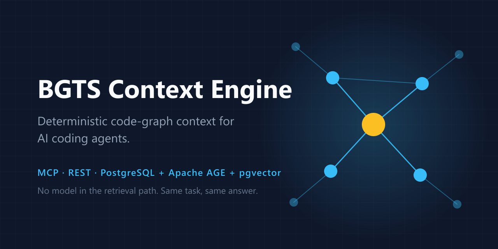

<!-- mcp-name: io.github.bgts-ai-org/bgts-context-engine -->

<div align="center">



**Deterministic code-graph context for AI coding agents.**

Ask *"why does the login timeout fire on the meeting webhook?"* and get the eight symbols
that actually answer it — ranked, budgeted, and reproducible.

[](https://pypi.org/project/bgts-context-engine/)
[](https://pypi.org/project/bgts-context-engine/)
[](https://github.com/bgts-ai-org/bgts-context-engine/actions/workflows/ci.yml)
[](LICENSE)
[](docs/mcp.md)
[](https://github.com/bgts-ai-org/bgts-context-engine/stargazers)

[Quick start](#quick-start) · [Use it from your agent](#use-it-from-your-agent) · [How it works](#how-it-works) · [Documentation](#documentation) · [Türkçe](README.tr.md)

</div>

---

## Why this exists

An agent working on an unfamiliar repository has to decide what to read before it can
decide what to change. The usual answer is embedding search over chunked files. It is cheap
to build and wrong in a specific way: it returns text that *reads* like the question rather
than code that *participates* in the behaviour. Ask about a login timeout and you get the
five files that mention timeouts, not the one function that sets it and the three callers
that break when you change it.

That information is structural, and it has an exact answer. `handleLogin` calls
`refreshSession`, which reads `SESSION_TTL`, which is written in exactly one place. That is
a graph walk.

BGTS Context Engine indexes your repositories into that graph — symbols, calls,
references, type hierarchies, HTTP routes, cross-language bridges — and answers questions
by walking it. Embeddings are used in one place only: finding entry points when the task
text names nothing recognisable. They never affect ranking.

**The same task text, against the same commit, returns the same context pack.** No model in
the retrieval path, no clock, no randomness. When an agent makes a bad change you can
replay exactly what it was told, find the stage that surfaced the wrong symbol, and fix
that stage.

The engine is published so people can run it. Organisations that want the same thing
inside their own perimeter — help with indexing, deployment, scoring tuned to their
repositories, or the agent stack around it — can engage
[BGTS](https://www.bgts.com) for consulting. Write to
**opensource-ai@bgts.com**.

<div align="center">
<video src="https://github.com/user-attachments/assets/ac8ddd8f-2148-4d16-8c3a-3ce69d32b9d8" width="820" controls playsinline>
UI walkthrough of the BGTS Context Engine web interface.
</video>
</div>

## Quick start

```bash
# 1. PostgreSQL 16 with Apache AGE + pgvector, in one database
docker compose -f deploy/docker-compose.yml up -d

# 2. Install and migrate
pip install bgts-context-engine
cp .env.example .env
bce migrate

# 3. Index something
bce index --repo /path/to/your/repo --name my-service

# 4. Ask
bce context --task "fix the login timeout in the meeting webhook"
```

Then serve it:

```bash
bce serve        # REST at :8000/docs, web UI at :8000/ui/
bce serve-mcp    # MCP over stdio, for agents
```

## Use it from your agent

The MCP surface is behind the `mcp` extra: `pip install "bgts-context-engine[mcp]"`. It
speaks stdio, so every MCP client configures it the same way — `bce serve-mcp`, plus the
database connection in the environment.

**Cursor** — `.cursor/mcp.json` in the project, or `~/.cursor/mcp.json` for every project:

```json
{
  "mcpServers": {
    "bgts-context-engine": {
      "command": "bce",
      "args": ["serve-mcp"],
      "env": { "BCE_DB_HOST": "localhost", "BCE_DB_NAME": "bce" }
    }
  }
}
```

**Claude Code** — one command:

```bash
claude mcp add bgts-context-engine --env BCE_DB_HOST=localhost -- bce serve-mcp
```

**VS Code** — `.vscode/mcp.json`:

```json
{
  "servers": {
    "bgts-context-engine": { "type": "stdio", "command": "bce", "args": ["serve-mcp"] }
  }
}
```

**Claude Desktop** — same block as Cursor, in `claude_desktop_config.json`.

Without a global install, `uvx --from "bgts-context-engine[mcp]" bce serve-mcp` works as the
`command` anywhere above.

Then ask your agent something that needs the repository rather than the file you have open:
*"what breaks if I change the session TTL?"* The agent calls `get_context_for_task`, and the
fourteen tools in [docs/mcp.md](docs/mcp.md) let it drill from there — exact callers, type
hierarchy, route handlers — without guessing at file names.

## What comes back

Not a list of file paths. A ranked pack, with the reasoning attached:

```json
{
  "anchors": {
    "python::api::webhooks::handle_meeting_webhook#a3f1": ["explicit", "lexical"],
    "python::auth::session::refresh_session#88c2":        ["lexical", "semantic"]
  },
  "context": {
    "items": [
      { "symbol_id": "...refresh_session#88c2", "detail_level": "full",
        "graph_distance": 0, "score": 11.42, "tokens": 214, "content": "def refresh_session(...)" },
      { "symbol_id": "...SESSION_TTL#4b0d",     "detail_level": "signature",
        "graph_distance": 2, "score": 6.10,  "tokens": 31,  "content": "SESSION_TTL: int" }
    ],
    "used_tokens": 2913, "budget": 4000, "included": 8, "skipped": 0
  },
  "coverage": {
    "anchor_source_count": 3, "connected_component_ratio": 0.875,
    "top_candidate_margin": 1.84, "orphan_ratio": 0.0,
    "touches_god_node": false, "commit_mismatch": false,
    "confidence": "high"
  }
}
```

Three things here that a vector store cannot give you:

**`anchors`** says *why* the engine looked where it did, and which independent sources
agreed. Three sources agreeing is usually right; one is a guess.

**`coverage`** is a trust report. `confidence: "low"` means the engine found something but
could not corroborate it — the moment for an agent to ask a follow-up question instead of
editing. `commit_mismatch` means the index is behind your working tree.

**`detail_level`** falls off with graph distance: the symbol you are changing arrives in
full, its neighbours as signatures, the outer ring as `name @ file:line`. That is how eight
genuinely relevant symbols fit in 4000 tokens.

## How it works

```
task text
   │
   ├─ anchors       four independent sources nominate entry points:
   │                explicit names, task history, full-text, vector
   ├─ expansion     fixed-shape graph walk: callers 2 hops, callees 1,
   │                references, type hierarchy, same-file siblings
   ├─ scoring       weighted sum over reference kind, task signal, centrality,
   │                distance, leaf penalty, edge provenance
   ├─ scope         drop repositories this caller may not see
   ├─ narrowing     keep the top N
   ├─ assembly      fit the token budget, cheaper detail further out
   └─ coverage      report how much of this is trustworthy
```

Callers reach two hops and callees only one, on purpose: when you change a function, what
breaks is upstream of it. Reference kind carries the heaviest weight, because a place that
*writes* a value is where the bug lives while a place that *reads* it is usually just
downstream. Centrality saturates at degree 20, because a logger touches everything and
explains nothing.

The full formula, every weight, and the confidence thresholds are in
[docs/retrieval.md](docs/retrieval.md).

## Features

- **Code graph, not chunks.** Symbols, `CALLS`, `REFERENCES`, `INHERITS`, `IMPLEMENTS`,
  `IMPORTS`, HTTP `ROUTES_TO` handlers, and `WHY:` comments bound to what they explain.
- **Deterministic by construction.** Sorted traversal, stable tiebreaks, versioned scoring
  weights. `bce bench` verifies it by running each case repeatedly and comparing output.
- **Six languages.** Python, JavaScript and TypeScript built in; Java, C# and Go behind the
  `langs` extra. [Adding one](docs/languages.md#adding-a-language) touches two files.
- **Cross-language call edges.** React Native and Expo bridges connect
  `NativeModules.Foo.bar()` in TypeScript to `bar` in Objective-C, Swift or Kotlin — a hole
  no single parser can see.
- **Edge provenance you can audit.** `scip` from a real compiler index, `treesitter` from
  syntax, `heuristic` from a pattern match. Scored differently, reported per response.
- **Incremental re-indexing.** `git diff` decides what to re-parse. Symbol ids survive file
  moves and reformatting, so history and embeddings stay valid.
- **One database.** Apache AGE and pgvector in the same PostgreSQL, so one query joins a
  graph traversal, a vector search and a SQL filter — and one `pg_dump` backs up the index.
- **MCP and REST from one implementation.** Fourteen tools over stdio, the same functions
  over HTTP. Nothing to drift.
- **A UI that explains itself.** `/ui` ships in the wheel and replays a real retrieval call
  stage by stage: anchors lighting up, expansion spreading, candidates scored and cut.
- **Runs offline.** The default embedding provider is deterministic arithmetic over token
  digests. No API key, no network, repeatable benchmarks.

## Where it fits

|  | Embedding RAG | Language server | BGTS Context Engine |
| --- | --- | --- | --- |
| Retrieval basis | text similarity | compiler index | code graph + anchors |
| Cross-file, cross-repo | weak | per project | yes |
| Cross-language edges | no | no | yes, heuristic |
| Same query, same answer | no | yes | yes |
| Ranked for *a task* | by similarity | not ranked | yes, with coverage |
| Token budget aware | chunk count | no | yes, detail by distance |
| Explains its own answer | no | no | anchors + provenance + confidence |

A language server is exact but scoped to what you have open. Embedding search is broad but
unaccountable. This sits between them: repository-wide and cross-language like the former,
exact and reproducible like the latter.

## Measuring it

Retrieval quality claims are worthless without the task set they were measured on, so the
harness ships instead of a leaderboard. You give it your own tasks and the symbols you
believe answer them:

```bash
bce bench --cases my-tasks.json --out report.json
```

Each case is a task text plus its ground-truth `symbol_id`s. The report gives recall,
precision, precision@1 and MRR per case, median and p95 latency, and two pass/fail checks
that matter more than the scores: every case is run repeatedly and must return a
byte-identical ordering, and any case with a scoped principal must not surface a repository
that principal cannot read.

Building the case file is the real work — it means deciding, by hand, what the right answer
is. It is also the only honest way to know whether a change to the scoring weights helped.
The format and a worked example are in
[docs/deployment.md](docs/deployment.md#benchmarking).

## Roadmap

Ordered by how often it comes up, not by difficulty:

- **Scope enforcement on every layer.** Layer 3 applies the per-user repository filter;
  Layers 1 and 2 do not. Until that closes, the API belongs behind a proxy — see
  [SECURITY.md](SECURITY.md).
- **Streamable HTTP transport for MCP.** Today the MCP surface is stdio only, so the server
  runs next to the agent. Remote transport makes one index serve a team.
- **More languages.** Rust, Kotlin and PHP are the most requested. The provider interface is
  the contribution path with the least friction — see
  [docs/languages.md](docs/languages.md#adding-a-language).
- **Wider SCIP ingestion.** Compiler-grade edges beat syntax-derived ones and are scored as
  such; more toolchains means more of the graph carries `scip` provenance.
- **A published benchmark corpus.** An open task set over public repositories, so results
  are comparable between projects rather than only between your own runs.

Requests and disagreements belong in
[issues](https://github.com/bgts-ai-org/bgts-context-engine/issues) — what people
actually ask for reorders this list.

## Documentation

| | |
| --- | --- |
| [Architecture](docs/architecture.md) | the deterministic line, the three layers, indexing |
| [Retrieval](docs/retrieval.md) | anchors, expansion, every scoring weight, confidence |
| [Data model](docs/data-model.md) | node labels, edge types, tables, symbol identity |
| [MCP and API](docs/mcp.md) | all 14 tools, every endpoint, the CLI |
| [Languages](docs/languages.md) | what each parser extracts, and how to add one |
| [Deployment](docs/deployment.md) | configuration reference, jobs, backup, benchmarking |
| [Web interface](web/README.md) | developing the frontend |

## Contributing

Contributions are welcome — especially new languages, which is the contribution the
pipeline is most ready for.

Read [CONTRIBUTING.md](CONTRIBUTING.md) first. The one rule worth knowing up front:
**determinism is the product.** A change that makes the same task return different results
will not be merged without an explicit opt-in flag, and anything touching scoring or
ordering needs a test that pins the output.

```bash
pip install -e ".[dev,mcp]"
ruff check src tests scripts && pytest
cd web && npm ci && npm test
```

## Security

The engine has no authentication of its own and expects to sit behind something that does.
Only the Layer-3 endpoints apply the per-user repository scope. Read
[SECURITY.md](SECURITY.md) before exposing a port, and report vulnerabilities privately
rather than in an issue.

## License

[MIT](LICENSE) © BGTS.

Built by [Oğuz Öztürk](https://github.com/oztrkoguz) and
[Enes İyidil](https://github.com/enesiyidil).
