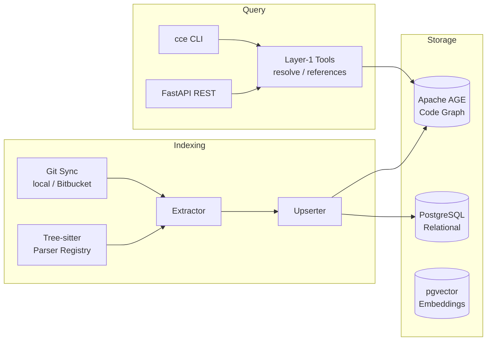

# Cortex Context Engine (CCE)

**Cortex Context Engine**, çok dilli kod depolarını deterministik bir **kod grafiğine** dönüştüren ve bu grafik üzerinden bağlam (context) sorguları sunan bir motorudur. LLM içermez; aynı kaynak kodu her zaman aynı düğüm/kenar yapısını üretir.

| Özellik | Açıklama |
|---------|----------|
| **Determinizm (P1)** | Aynı commit + aynı kaynak → byte-identical payload |
| **Çok dil** | Python, JavaScript, TypeScript, TSX (tree-sitter AST) |
| **Tek veritabanı (P5)** | PostgreSQL + Apache AGE (graf) + pgvector (embedding) |
| **Katman-1 araçlar** | Sembol çözümleme, referans bulma |
| **Uzak indeksleme** | Bitbucket Cloud URL'den clone/fetch + indeks |
| **i18n** | Mesajlar `en` / `tr`; payload locale'den etkilenmez |

> **Sürüm:** 0.0.1 (Phase 0) — SCIP entegrasyonu, embedding üretimi, incremental re-index ve RLS henüz planlanmış aşamalardadır.

---

## İçindekiler

- [Mimari](#mimari)
- [Gereksinimler](#gereksinimler)
- [Kurulum](#kurulum)
- [Veritabanı](#veritabanı)
- [Yapılandırma](#yapılandırma)
- [CLI Kullanımı](#cli-kullanımı)
- [REST API](#rest-api)
- [Desteklenen Diller](#desteklenen-diller)
- [Veri Modeli](#veri-modeli)
- [Proje Yapısı](#proje-yapısı)
- [Geliştirme](#geliştirme)
- [Yol Haritası](#yol-haritası)

---

## Mimari

CCE üç ana hattadan oluşur: **indeksleme**, **depolama** ve **sorgulama**.



### İndeksleme hattı

1. **Git sync** — Yerel dizin veya Bitbucket Cloud URL'si; uzak repolar `.cce_data/repos` altında önbelleğe alınır (re-index'te `git fetch` yeterli).
2. **Extractor** — Dosya uzantısına göre dil sağlayıcısı seçilir, AST ayrıştırılır, `GraphFragment` üretilir.
3. **Upserter** — Düğüm/kenarlar Apache AGE grafiğine `MERGE` ile yazılır; repo meta verisi SQL tablolarına kaydedilir.

### Sorgulama (Layer-1)

- `resolve-symbol` — İsme göre sembol eşleştirme
- `find-references` — Bir `symbol_id`'ye giden çağrı/referans kenarları

Her araç `{ tool, payload, message, locale }` zarfını döner. **`payload` locale'den bağımsızdır**; yalnızca `message` çevrilir.

---

## Gereksinimler

| Bileşen | Minimum |
|---------|---------|
| Python | 3.11+ |
| PostgreSQL | 16 (Apache AGE + pgvector ile) |
| Git | Uzak indeksleme için |
| Docker | Önerilen (DB kurulumu için) |

---

## Kurulum

```bash
# Repoyu klonlayın
git clone <repo-url> context-engine
cd context-engine

# Sanal ortam (önerilir)
python -m venv .venv
# Windows
.venv\Scripts\activate
# Linux/macOS
source .venv/bin/activate

# Paketi editable modda kurun
pip install -e ".[dev]"
```

Kurulum sonrası `cce` komutu kullanılabilir olur:

```bash
cce --help
```

---

## Veritabanı

CCE tek bir PostgreSQL sunucusunda üç katmanı birleştirir:

- **Apache AGE** — Kod grafiği (`code_graph`)
- **pgvector** — Sembol/dosya embedding'leri (Phase 2)
- **İlişkisel tablolar** — Repo meta, görev geçmişi, audit, RLS kapsamları

### Docker ile hızlı başlangıç

```bash
docker compose -f deploy/docker-compose.yml up -d
```

Bu komut PostgreSQL 16 + pgvector + Apache AGE içeren `cce-postgres-age-pgvector:pg16` imajını derler ve `localhost:5432` üzerinde ayağa kaldırır.

Varsayılan kimlik bilgileri:

| Değişken | Değer |
|----------|-------|
| Host | `localhost` |
| Port | `5432` |
| Database | `cce` |
| User | `cce` |
| Password | `cce` |

### Migrasyon

Veritabanı hazır olduktan sonra şemayı uygulayın:

```bash
cce migrate
```

Migrasyonlar `cce/storage/relational/migrations/` altındaki SQL dosyalarını sırayla çalıştırır:

| Dosya | İçerik |
|-------|--------|
| `0001_extensions_graph.sql` | AGE + pgvector extension, `code_graph` oluşturma |
| `0002_relational.sql` | `repos`, `tasks`, `users`, `scopes`, `audit_log` |
| `0003_vector.sql` | `embeddings` tablosu (768 boyut, HNSW indeks) |

---

## Yapılandırma

`.env.example` dosyasını kopyalayın:

```bash
cp .env.example .env
```

Tüm ayarlar `CCE_` öneki ile ortam değişkenlerinden okunur:

```env
# PostgreSQL
CCE_DB_HOST=localhost
CCE_DB_PORT=5432
CCE_DB_NAME=cce
CCE_DB_USER=cce
CCE_DB_PASSWORD=cce

# i18n (yalnızca mesajlar; payload etkilenmez)
CCE_DEFAULT_LOCALE=en

# Bitbucket Cloud uzak indeksleme
CCE_BITBUCKET_USERNAME=
CCE_BITBUCKET_TOKEN=
CCE_REPO_CACHE_DIR=.cce_data/repos
CCE_GIT_SSL_VERIFY=true
```

### Bitbucket kimlik doğrulama

| Token türü | Username | Clone formatı |
|------------|----------|---------------|
| Workspace/repo access token | Boş bırakın | `x-token-auth:<token>` |
| App password / ATATT API token | Bitbucket kullanıcı adı | `username:token` |

Token'lar `.git/config` dosyasına **asla yazılmaz**; yalnızca tek seferlik git çağrısında URL'ye enjekte edilir.

---

## CLI Kullanımı

### Desteklenen dilleri listele (DB gerekmez)

```bash
cce languages
```

### Yerel repo indeksle

```bash
cce index --repo /path/to/my-repo --name my-org/my-repo
```

Opsiyonel parametreler:

- `--commit <sha>` — Commit override
- `--locale tr` — Çıktı mesaj dili

### Bitbucket'dan uzak indeksle

```bash
cce index-remote \
  --url https://bitbucket.org/workspace/repo-slug \
  --name workspace/repo-slug \
  --branch main
```

Desteklenen URL biçimleri:

- `https://bitbucket.org/acme/widgets`
- `https://bitbucket.org/acme/widgets.git`
- `https://bitbucket.org/acme/widgets/src/main/...` (web Source URL)
- `git@bitbucket.org:acme/widgets.git` (SSH — clone HTTPS üzerinden yapılır)

### Sembol çözümle

```bash
cce resolve-symbol --name MyClass --repo my-org/my-repo
```

### Referans bul

```bash
cce find-references --symbol-id "python::pkg::ns::MyClass#abc123..."
```

### REST API sunucusu

```bash
cce serve --host 0.0.0.0 --port 8000
# Geliştirme modu (auto-reload)
cce serve --reload
```

---

## REST API

Sunucu başlatıldığında OpenAPI dokümantasyonu şu adreste:

- Swagger UI: `http://127.0.0.1:8000/docs`
- ReDoc: `http://127.0.0.1:8000/redoc`

### Endpoint'ler

| Method | Path | Açıklama |
|--------|------|----------|
| `GET` | `/healthz` | Canlılık + DB erişilebilirliği |
| `GET` | `/v1/languages` | Desteklenen diller/uzantılar |
| `GET` | `/v1/resolve-symbol?name=...&repo=...` | Sembol çözümle |
| `GET` | `/v1/find-references?symbol_id=...` | Referans bul |
| `POST` | `/v1/index` | Yerel repo indeksle |
| `POST` | `/v1/index-remote` | Bitbucket repo indeksle |

### Örnek istekler

**Yerel indeks:**

```bash
curl -X POST http://127.0.0.1:8000/v1/index \
  -H "Content-Type: application/json" \
  -d '{"repo_path": "/path/to/repo", "name": "my-org/my-repo"}'
```

**Uzak indeks:**

```bash
curl -X POST http://127.0.0.1:8000/v1/index-remote \
  -H "Content-Type: application/json" \
  -d '{"url": "https://bitbucket.org/workspace/repo", "branch": "main"}'
```

**Sembol çözümle (Türkçe mesaj):**

```bash
curl "http://127.0.0.1:8000/v1/resolve-symbol?name=MyClass&locale=tr"
```

### Yanıt zarfı

```json
{
  "tool": "resolve_symbol",
  "payload": {
    "matches": [
      {
        "symbol_id": "python::mypkg::MyClass::MyClass#...",
        "kind": "class",
        "signature": null,
        "docstring": "...",
        "file_id": "my-repo:src/main.py",
        "line": 42,
        "indexed_at_commit": "abc123..."
      }
    ],
    "indexed_at_commit": "abc123..."
  },
  "message": null,
  "locale": "tr"
}
```

Locale, `Accept-Language` başlığı veya `?locale=tr` sorgu parametresi ile belirlenir.

---

## Desteklenen Diller

Phase 0'da kayıtlı dil sağlayıcıları:

| Dil | Uzantılar | Çıkarılan yapılar |
|-----|-----------|-------------------|
| Python | `.py`, `.pyi` | Sınıf, fonksiyon, method; IMPORTS, INHERITS, CALLS |
| JavaScript | `.js`, `.jsx`, `.mjs`, `.cjs` | Modül sembolleri, import/call kenarları |
| TypeScript | `.ts`, `.d.ts` | Arayüz, tip, sınıf, fonksiyon |
| TSX | `.tsx` | TS + JSX bileşenleri |

Atlanan dizinler: `.git`, `node_modules`, `.venv`, `__pycache__`, `dist`, `build` ve benzeri.

Yeni dil eklemek için `LanguageProvider` implementasyonu yazıp `build_default_registry()` içinde kaydedin.

---

## Veri Modeli

### Graf düğümleri (`NodeLabel`)

| Düğüm | Kimlik alanı | Açıklama |
|-------|--------------|----------|
| `Repo` | `repo_id` | Mantıksal depo |
| `File` | `file_id` | Kaynak dosya |
| `Symbol` | `symbol_id` | Fonksiyon, sınıf, method vb. |
| `Module` | `module_id` | Paket/modül |
| `Route` | `route_id` | HTTP route (Phase 1+) |
| `DesignNote` | `note_id` | TODO/FIXME/HACK yorumları (Phase 1+) |

### Graf kenarları (`EdgeLabel`)

| Kenar | Yön | Açıklama |
|-------|-----|----------|
| `DEFINED_IN` | Symbol → File | Tanım konumu |
| `BELONGS_TO` | File → Repo | Dosya-depo ilişkisi |
| `IMPORTS` | File/Module → File/Module | Import |
| `CALLS` | Symbol → Symbol | Çağrı |
| `INHERITS` | Symbol → Symbol | Kalıtım |
| `IMPLEMENTS` | Symbol → Symbol | Arayüz implementasyonu |
| `REFERENCES` | Symbol → Symbol | Referans (`ref_kind` ile) |
| `ROUTES_TO` | Route → Symbol | Route handler |
| `EXPLAINS` | DesignNote → Symbol | Tasarım notu |

### Kimlik üretimi

Sembol kimlikleri SCIP-moniker mantığıyla üretilir ve **commit'ten bağımsızdır**:

```
{language}::{package}::{namespace}::{name}#{blake2b_hash}
```

Örnek: `python::mypkg::services::UserService#create_user#a1b2c3d4e5f67890`

Bu sayede araçlar zincirlenebilir: bir aracın `symbol_id` çıktısı, diğerinin girdisi olur.

### Provenance

Her kenar kaynağını taşır:

| Değer | Anlam |
|-------|-------|
| `treesitter` | AST çıkarımı (Phase 0 varsayılan) |
| `scip` | SCIP çözümlemesi (gelecek faz) |
| `heuristic` | Sentezlenmiş köprü kenarları |

---

## Proje Yapısı

```
context-engine/
├── cce/                          # Ana Python paketi
│   ├── cli.py                    # Typer CLI giriş noktası
│   ├── config.py                 # Pydantic Settings (CCE_* env)
│   ├── api/rest/                 # FastAPI REST katmanı
│   ├── core/i18n/                # Çeviri katalogları (en, tr)
│   ├── domain/                   # GraphNode, GraphEdge, enum'lar
│   ├── indexing/
│   │   ├── indexer.py            # İndeksleme orkestratörü
│   │   ├── extractor/            # Dil-agnostik çıkarım
│   │   ├── parser/               # Tree-sitter sağlayıcıları
│   │   ├── gitsync/              # Yerel/uzak git sync
│   │   └── upserter/             # AGE graf yazımı
│   ├── storage/
│   │   ├── graph/                # Apache AGE Cypher client
│   │   └── relational/           # SQL + migrator
│   └── tools/layer1/             # resolve_symbol, find_references
├── deploy/
│   ├── docker-compose.yml        # PostgreSQL + AGE + pgvector
│   ├── Dockerfile
│   └── initdb/                   # İlk container init SQL
├── tests/                        # pytest testleri
├── pyproject.toml
└── .env.example
```

---

## Geliştirme

### Testler

```bash
pytest
# Coverage ile
pytest --cov=cce
```

Test kapsamı: API, git sync, Bitbucket URL parsing, Python/JS-TS extractor, symbol_id, i18n.

### Lint

```bash
ruff check cce tests
ruff format cce tests
```

### Yerel geliştirme akışı

```bash
# 1. DB'yi başlat
docker compose -f deploy/docker-compose.yml up -d

# 2. Migrasyon
cce migrate

# 3. Örnek repo indeksle
cce index --repo . --name context-engine

# 4. Sorgula
cce resolve-symbol --name Indexer --repo context-engine

# 5. API (opsiyonel)
cce serve --reload
```

---

## Yol Haritası

| Faz | Durum | Kapsam |
|-----|-------|--------|
| **Phase 0** | ✅ Mevcut | AST çıkarım, full-index, Layer-1 araçlar, REST/CLI |
| **Phase 1** | Planlanmış | Incremental re-index, cross-file SCIP, route extraction |
| **Phase 2** | Planlanmış | Embedding üretimi, semantik anchor bulma |
| **Phase 3** | Planlanmış | Context paketi birleştirme, skorlama |
| **Phase 4** | Planlanmış | RLS, multi-tenant erişim kontrolü |

Phase 0 kapsamında **henüz yapılmayan** özellikler:

- Cross-file / cross-repo sembol çözümlemesi (SCIP)
- `REFERENCES.ref_kind` zenginleştirmesi (define/write/read/pass)
- Embedding üretimi ve vektör arama
- Incremental re-index (`delete_file_subgraph` altyapısı hazır)
- Framework-aware HTTP route çıkarımı
- Inline yorumlardan design note çıkarımı

---

## Lisans

Proprietary — Cortex
